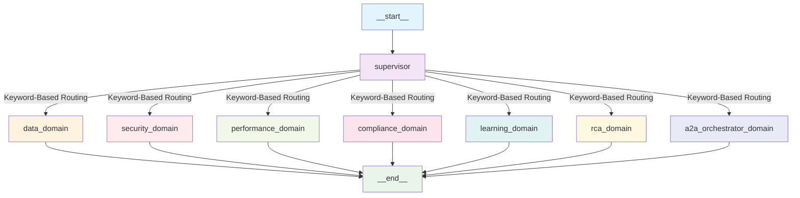
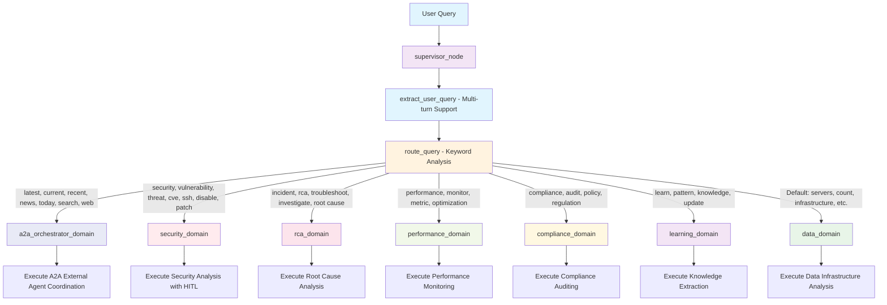
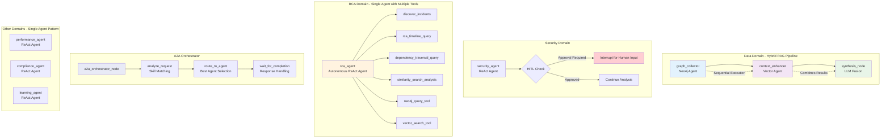
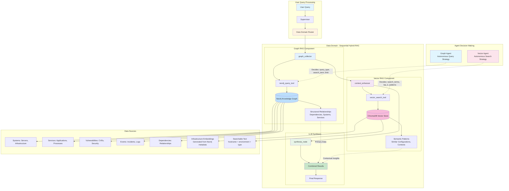
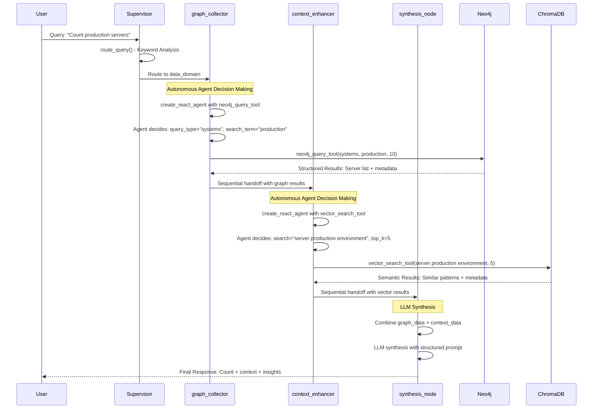

# 🤖 xAIOps: Enterprise AI Operations Platform

[](https://www.python.org/downloads/)
[](https://langchain-ai.github.io/langgraph/)
[](https://neo4j.com/)
[](LICENSE)

An advanced multi-agent AI operations platform that revolutionizes infrastructure management through intelligent conversation-aware routing, specialized domain expertise, and sophisticated GraphRAG capabilities. Built on LangGraph with Neo4j knowledge graphs, high-performance semantic vector search, and robust multi-turn conversation handling.

## 🌟 What is xAIOps?

xAIOps is an enterprise-grade AI operations platform that combines:
- **7 Specialized Domain Agents** with pure LangGraph agentic decision-making
- **Conversation-Aware Intelligent Routing** with multi-turn context handling and autonomous reasoning
- **High-Performance GraphRAG** with 14+ Neo4j query patterns and optimized semantic search (164.9x speedup)
- **Human-in-the-Loop Workflows** with proper LangGraph interrupt() for critical security decisions
- **Agent-to-Agent Communication** for external system integration
- **Production-Ready Architecture** with robust error handling, conversation continuity, and monitoring

### 🎯 Key Use Cases

- **Infrastructure Analysis**: Comprehensive system inventory, dependency mapping, and relationship analysis
- **Security Assessment**: Vulnerability analysis, attack surface mapping, and risk prioritization with approval workflows
- **Performance Optimization**: Resource monitoring, capacity planning, and bottleneck identification
- **Incident Response**: Root cause analysis, timeline correlation, and impact assessment
- **Compliance Auditing**: Regulatory adherence tracking, policy gap analysis, and audit trail generation
- **Knowledge Management**: Pattern extraction, best practice identification, and organizational learning

## 🏗️ System Architecture

The system follows a sophisticated multi-agent architecture with intelligent routing and domain specialization:

### 🔄 Main System Flow



### 🎛️ Supervisor Routing Logic Detail



### 📊 Domain Agent Architecture



### 🏗️ Detailed Hybrid RAG Architecture



### ⚙️ Technical Implementation Flow



### 🧠 Intelligent Supervisor System

**Simple & Reliable Routing Strategy:**
1. **Keyword-Based Routing**: Fast, deterministic routing based on content analysis
2. **Multi-turn Support**: Proper message extraction (state["messages"][-1]) for conversation continuity
3. **External Agent Integration**: Smart routing to A2A orchestrator for external data needs
4. **Domain Specialization**: Direct routing to specialized agents based on query patterns

**Key Features:**
- **Multi-turn Conversation Handling**: Fixed message extraction for seamless follow-ups
- **External Data Routing**: Automatic detection of queries requiring external information (latest, current, news, search)
- **Security Action Recognition**: Enhanced keyword detection for security operations (ssh, disable, patch, cve)
- **Pure Agentic Domain Execution**: Within domains, agents autonomously decide query parameters and strategies
- **HITL Workflows**: LangGraph interrupt() for proper Human-in-the-Loop approval gates
- **Default Fallback**: Intelligent fallback to data domain for infrastructure queries

### 🎯 Domain-Specialized Agents (7 Expert Systems)

| Domain | Purpose | Key Capabilities | Tools Used |
|--------|---------|------------------|------------|
| **Data Domain** | Infrastructure inventory & analysis | Pure agentic query strategy, intelligent parameter selection, multi-turn conversation handling | Neo4j (14 query types), Vector search |
| **Security Domain** | Cybersecurity analysis & risk assessment | Vulnerability analysis, attack surface mapping, HITL approval | Enhanced GraphRAG, Security correlation |
| **Performance Domain** | Resource optimization & monitoring | Capacity planning, bottleneck identification, metrics analysis | Performance analytics, Trend analysis |
| **Compliance Domain** | Regulatory adherence & auditing | Policy gap analysis, audit trails, regulatory mapping | Compliance frameworks, Documentation |
| **Learning Domain** | Knowledge extraction & pattern analysis | Conversation analysis, best practice extraction, knowledge updates | Pattern recognition, Learning algorithms |
| **RCA Domain** | Root cause analysis & incident response | Timeline correlation, dependency impact, incident analysis | Advanced graph traversal, Temporal analysis |
| **A2A Orchestrator** | Intelligent external agent coordination | Sophisticated agent discovery, skill-based routing, confidence scoring, LlamaStack integration | A2A Protocol, LangGraph workflows, Agent capability matching |

### 🛠️ Technology Stack

**Core Framework:**
- **[LangGraph 0.2.0+](https://langchain-ai.github.io/langgraph/)**: State-based agent orchestration with conditional routing and built-in persistence (no custom checkpointers needed)
- **[Python 3.11+](https://www.python.org/)**: Modern Python with type hints and async support

**AI & Language Models:**
- **[LangChain Core 0.3.0+](https://python.langchain.com/)**: LLM integration and tool calling
- **Custom LLM Integration**: Llama-4-Scout-17B with structured output support
- **[Pydantic 2.0+](https://pydantic.dev/)**: Type-safe structured outputs and validation

**Data & Knowledge:**
- **[Neo4j 5.0+](https://neo4j.com/)**: Knowledge graph database with advanced Cypher patterns
- **[ChromaDB 0.4.0+](https://www.trychroma.com/)**: High-performance vector embeddings with global singleton optimization (164.9x speedup)
- **Enhanced GraphRAG**: 14+ specialized query patterns with intelligent agentic parameter selection

**Communication & Integration:**
- **[A2A SDK 0.2.6+](https://github.com/meta-llama/llama-stack)**: Agent-to-agent communication protocol
- **[FastAPI 0.104.0+](https://fastapi.tiangolo.com/)**: High-performance API framework
- **[HTTPX 0.25.0+](https://www.python-httpx.org/)**: Async HTTP client for external integrations

## 🚀 Quick Start

### Prerequisites

- **Python 3.11+** with pip and virtual environment support
- **Neo4j Desktop** or Neo4j server instance
- **Custom LLM Endpoint** (Llama-4-Scout-17B or compatible)
- **Git** for cloning the repository

### 1. Installation

```bash
# Clone the repository
git clone https://github.com/your-org/xaiops-graphrag.git
cd xaiops-graphrag

# Create and activate Python 3.11 virtual environment
python3.11 -m venv .venv311
source .venv311/bin/activate  # On Windows: .venv311\Scripts\activate

# Install dependencies
pip install -e .
pip install -U "langgraph-cli[inmem]"
```

### 2. Environment Configuration

Create a `.env` file in the project root:

```bash
# Neo4j Configuration
NEO4J_URI=bolt://localhost:7687
NEO4J_USERNAME=neo4j
NEO4J_PASSWORD=your_neo4j_password
NEO4J_DATABASE=neo4j

# LLM Configuration
LLM_BASE_URL=https://your-llm-endpoint.com:443/v1
LLM_API_KEY=your_api_key_here
LLM_MODEL_NAME=llama-4-scout-17b-16e-w4a16

# Optional: Vector Store Configuration
CHROMA_PERSIST_DIRECTORY=./chroma_db

# A2A Configuration (for external agent integration)
A2A_ORCHESTRATOR_URL=http://localhost:8000
A2A_WEB_SEARCH_URL=http://localhost:8002

# LlamaStack Configuration (for web search agent)
LLAMASTACK_BASE_URL=https://lss-lss.apps.prod.rhoai.rh-aiservices-bu.com/v1
LLAMASTACK_AGENT_ID=your-agent-id-here
# Note: Update LLAMASTACK_AGENT_ID with your actual LlamaStack agent ID
```

### 3. Database Setup

**Neo4j Setup:**
1. Install and start Neo4j Desktop
2. Create a new database or use existing
3. Populate with your infrastructure data

**Vector Store Setup:**
```bash
# The system will automatically populate ChromaDB from Neo4j data
# Optimized with global singleton pattern for 164.9x performance improvement
# Data loads once on first request, then reuses in-memory collection
# Ensure your infrastructure metadata is available at the configured path
```

### 4. Launch the System

For the **complete multi-agent system** with A2A communication, you need to start **4 components** in separate terminals:

#### **Terminal 1: A2A Orchestrator (Port 8000)**
```bash
cd /path/to/xaiops-graphrag
python -m src.app.a2a_orchestrator
```

#### **Terminal 2: A2A Ops Server (Port 8001)**
```bash
cd /path/to/xaiops-graphrag
python -m src.app.a2a_ops_server
```

#### **Terminal 3: LlamaStack A2A Agent (Port 8002)**
```bash
cd /path/to/xaiops-graphrag
python -m src.app.llamastack_a2a_agent
```

#### **Terminal 4: LangGraph Development Server**
```bash
cd /path/to/xaiops-graphrag
langgraph dev
```

### **🚀 System Availability**

Once all components are running, the system will be available at:
- **🌐 API Endpoints**: http://127.0.0.1:2024/docs
- **🎨 LangGraph Studio**: https://smith.langchain.com/studio/?baseUrl=http://127.0.0.1:2024
- **📊 Health Check**: http://127.0.0.1:2024/health
- **🤖 A2A Orchestrator**: http://localhost:8000
- **🔧 A2A Ops Agent**: http://localhost:8001
- **🔍 A2A Web Search Agent**: http://localhost:8002

### **⚡ Quick Start (Internal Only)**

For **internal operations only** (without external web search), you can start just the LangGraph server:

```bash
langgraph dev
```

This will provide access to all internal domain agents (data, security, performance, compliance, learning, RCA) but not external web search capabilities.

## 🤖 **Advanced A2A Orchestrator**

The A2A (Agent-to-Agent) orchestrator implements sophisticated multi-agent coordination using LangGraph workflows and the A2A protocol:

### **🧠 Intelligent Agent Selection**

The orchestrator uses a **multi-phase selection process**:

1. **Agent Discovery**: Automatically discovers and registers available agents
2. **Skill Matching**: Analyzes query against agent skill tags (e.g., 'news', 'latest', 'security')
3. **Confidence Scoring**: Calculates match confidence based on skill overlap
4. **Best Agent Selection**: Routes to highest-scoring agent with detailed reasoning

### **🎯 Agent Capabilities**

**Web Search Agent** (LlamaStack Integration):
- **Skills**: Web Search, Current Events
- **Tags**: ['web', 'search', 'current', 'news', 'latest', 'internet', 'events', 'recent', 'today']
- **Endpoint**: Real-time web search via LlamaStack
- **Use Cases**: Latest news, current events, web searches

**Ops Infrastructure Agent**:
- **Skills**: Infrastructure Analysis, Security Analysis, RCA Investigation, Performance Monitoring
- **Tags**: ['infrastructure', 'servers', 'systems', 'security', 'vulnerabilities', 'rca', 'incidents']
- **Endpoint**: Internal LangGraph workflows
- **Use Cases**: Infrastructure queries, security analysis, troubleshooting

### **📊 Query Routing Examples**

```
Query: "Latest Kubernetes security news"
→ Matches: Web Search Agent (tags: 'latest', 'news', 'security')
→ Confidence: 1.0 (3 skill matches)
→ Result: Real web search results via LlamaStack

Query: "Count servers in production"
→ Matches: Ops Infrastructure Agent (tags: 'servers', 'infrastructure')
→ Confidence: 0.7 (2 skill matches)
→ Result: Neo4j database query results
```

### **🔄 LangGraph Workflow**

The orchestrator uses a sophisticated LangGraph workflow:

```python
workflow = StateGraph(RouterState)
workflow.add_node("analyze", _analyze_request)  # Agent skill matching
workflow.add_node("route", _route_to_agent)     # Execute selected agent
workflow.add_edge("analyze", "route")
```

This provides **production-ready agent coordination** with proper state management, error handling, and response aggregation.

## 📖 Usage Examples

### Basic Infrastructure Queries

```bash
# Count all servers in infrastructure
curl -X POST "http://127.0.0.1:2024/runs/wait" \
  -H "Content-Type: application/json" \
  -d '{
    "assistant_id": "xaiops",
    "input": {
      "messages": [{"role": "user", "content": "Count all servers in our infrastructure"}]
    }
  }'
```

### Web Search and External Data

```bash
# Get latest Kubernetes security news
curl -X POST "http://127.0.0.1:2024/runs/wait" \
  -H "Content-Type: application/json" \
  -d '{
    "assistant_id": "xaiops",
    "input": {
      "messages": [{"role": "user", "content": "Latest Kubernetes security news"}]
    }
  }'

# Search for current cloud security trends
curl -X POST "http://127.0.0.1:2024/runs/wait" \
  -H "Content-Type: application/json" \
  -d '{
    "assistant_id": "xaiops",
    "input": {
      "messages": [{"role": "user", "content": "Current cloud security trends 2024"}]
    }
  }'
```

### Security Analysis

```bash
# Comprehensive security vulnerability assessment
curl -X POST "http://127.0.0.1:2024/runs/wait" \
  -H "Content-Type: application/json" \
  -d '{
    "assistant_id": "xaiops",
    "input": {
      "messages": [{"role": "user", "content": "Analyze security vulnerabilities requiring approval"}]
    }
  }'
```

### Performance Analysis

```bash
# Performance bottleneck identification
curl -X POST "http://127.0.0.1:2024/runs/wait" \
  -H "Content-Type: application/json" \
  -d '{
    "assistant_id": "xaiops",
    "input": {
      "messages": [{"role": "user", "content": "Identify performance bottlenecks in payment services"}]
    }
  }'
```

### Root Cause Analysis

```bash
# Incident investigation with timeline analysis
curl -X POST "http://127.0.0.1:2024/runs/wait" \
  -H "Content-Type: application/json" \
  -d '{
    "assistant_id": "xaiops",
    "input": {
      "messages": [{"role": "user", "content": "Analyze incident INC001234 with dependency impact"}]
    }
  }'
```

### Streaming Responses

```bash
# Real-time streaming for complex analysis
curl -X POST "http://127.0.0.1:2024/runs/stream" \
  -H "Content-Type: application/json" \
  -d '{
    "assistant_id": "xaiops",
    "input": {
      "messages": [{"role": "user", "content": "Comprehensive infrastructure health assessment"}]
    },
    "stream_mode": "values"
  }'
```

## 📁 Project Structure

```
xaiops-graphrag/
├── 📄 README.md                     # This comprehensive guide
├── 📄 LICENSE                       # MIT License
├── 📄 pyproject.toml                # Python project configuration
├── 📄 langgraph.json               # LangGraph server configuration
├── 📄 .env                         # Environment variables (create this)
│
├── 📂 src/app/                      # Main application source
│   ├── 📄 main.py                  # LangGraph server entry point
│   ├── 📄 llm_config.py            # LLM configuration and initialization
│   ├── 📄 state.py                 # State management for LangGraph workflows
│   │
│   ├── 📂 graphs/                   # LangGraph workflow definitions
│   │   ├── 📄 supervisor.py        # Intelligent routing supervisor
│   │   ├── 📄 domain_subgraphs.py  # Domain-specific agent workflows
│   │   ├── 📄 rca_subgraph.py      # Root cause analysis workflows
│   │   └── 📄 a2a_orchestrator_subgraph.py  # External agent integration
│   │
│   ├── 📂 tools/                    # AI agent tools and integrations
│   │   ├── 📄 data_tools.py        # Enhanced Neo4j tools (14 query types)
│   │   ├── 📄 vector_search.py     # ChromaDB semantic search
│   │   ├── 📄 rca_tools.py         # Root cause analysis tools
│   │   └── 📄 hitl_tools.py        # Human-in-the-loop workflow tools
│   │
│   ├── 📂 prompts/                  # Agent behavior definitions
│   │   ├── 📄 security_domain.md   # Security analysis framework
│   │   ├── 📄 performance_domain.md # Performance optimization framework
│   │   ├── 📄 compliance_domain.md # Compliance auditing framework
│   │   ├── 📄 rca_domain.md        # Root cause analysis framework
│   │   ├── 📄 learning_domain.md   # Knowledge extraction framework
│   │   ├── 📄 graph_collector.md   # Graph query strategy framework
│   │   └── 📄 vector_collector.md  # Semantic search framework
│   │
│   ├── 📄 a2a_orchestrator.py      # A2A agent coordination
│   ├── 📄 a2a_agent_executor.py    # A2A execution framework
│   ├── 📄 a2a_ops_server.py        # A2A operations server
│   └── 📄 llamastack_a2a_agent.py  # LlamaStack integration
│
└── 📂 chroma_db/                   # ChromaDB vector store (auto-created)
```

## 🔧 Advanced Configuration

### Intelligent Query Strategy 

The system uses **Pure LangGraph Agentic Approach** for intelligent query parameter selection:

**Autonomous Decision-Making:**
- **Intent Recognition**: Agents understand user intent (count, inventory, analysis, etc.)
- **Parameter Selection**: Intelligent mapping of natural language to optimal query parameters  
- **Environment Handling**: Automatic filtering for production, staging, dev environments
- **Synonym Recognition**: Handles "nodes", "servers", "machines", "hosts" seamlessly

**Available Query Types (Agent-Selected):**
- `systems`: Infrastructure inventory and server discovery
- `services`: Application services and health status  
- `vulnerabilities`: Security vulnerability assessment
- `events`: Operational events and incident tracking
- `dependencies`: Service dependency mapping
- `overview`: High-level infrastructure overview
- `system_neighbors`: Direct relationship neighborhood analysis
- `vulnerability_impact`: Enhanced impact assessment with affected entities
- `service_health`: Service status with dependency context
- `incident_correlation`: System-incident relationship mapping
- `dependency_path`: Shortest path analysis between systems
- `system_context`: Rich contextual information with multi-hop relationships
- `search`: Keyword-based entity discovery across all properties
- `cypher`: Custom Cypher query execution for complex patterns

**Performance Optimizations:**
- **Vector Search**: Global singleton pattern with 164.9x performance improvement
- **Multi-turn Conversations**: Proper message extraction for seamless follow-ups
- **Conversation Context**: Maintains query history and domain continuity

### Agent Prompt Customization

Each domain agent uses sophisticated prompt frameworks located in `src/app/prompts/`. These can be customized for your specific infrastructure and organizational needs:

```bash
# Example: Customize security analysis framework
vim src/app/prompts/security_domain.md

# Example: Modify RCA methodology
vim src/app/prompts/rca_domain.md
```

### Human-in-the-Loop Configuration

Security and compliance workflows include HITL gates for critical decisions using LangGraph's interrupt() function:

```python
# Example: Configure security approval thresholds
# In src/app/tools/hitl_tools.py
from langgraph.types import interrupt

@tool
def security_approval_gate(finding: str, risk_level: str) -> str:
    """Proper LangGraph HITL implementation with interrupt()"""
    # Use LangGraph interrupt to pause execution and wait for human input
    response = interrupt({
        "type": "security_approval",
        "finding": finding,
        "risk_level": risk_level,
        "question": f"⚠️ SECURITY APPROVAL REQUIRED\n\nAction: {finding}\nRisk Level: {risk_level}\n\nDo you approve this action?",
        "options": ["approve", "deny"]
    })
    
    if response and response.lower() in ["approve", "approved", "yes", "y"]:
        return f"✅ APPROVED: {finding} - Proceeding with security action"
    else:
        return f"❌ DENIED: {finding} - Security action blocked by human reviewer"
```

## 🧪 Development Guide

### Local Development Setup

```bash
# Install development dependencies
pip install -e ".[dev]"

# Run tests
pytest tests/

# Type checking
mypy src/

# Code formatting
black src/
ruff check src/
```

### Creating Custom Domain Agents

1. **Create Domain Subgraph:**
```python
# src/app/graphs/my_domain_subgraph.py
from langgraph.graph import StateGraph, START, END, MessagesState
from langgraph.prebuilt import create_react_agent

def create_my_domain_subgraph():
    workflow = StateGraph(MessagesState)
    
    my_agent = create_react_agent(
        model=get_llm(),
        tools=[your_custom_tools],
        prompt=load_prompt("my_domain"),
        name="my_agent"
    )
    
    workflow.add_node("my_agent", my_agent)
    workflow.add_edge(START, "my_agent")
    workflow.add_edge("my_agent", END)
    
    return workflow.compile()
```

2. **Create Domain Prompt:**
```markdown
<!-- src/app/prompts/my_domain.md -->
You are an expert in [your domain] performing [specific analysis type].

## Analysis Framework
1. **Discovery Phase**: Use [specific tools] to gather initial data
2. **Assessment Phase**: Analyze findings using [methodology]
3. **Reporting Phase**: Provide structured recommendations

## Tool Usage Guidelines
- Use [tool_name] for [specific purpose]
- Apply [methodology] for [analysis type]

## Output Format
**[SECTION NAME]**
- Key Finding: [Details]
- Confidence Level: [High/Medium/Low]
- Recommendations: [Action items]
```

3. **Register in Supervisor:**
```python
# Add to src/app/graphs/supervisor.py
from app.graphs.my_domain_subgraph import create_my_domain_subgraph

# In create_supervisor() function:
workflow.add_node("my_domain", create_my_domain_subgraph())
```

### Custom Tool Development

```python
# src/app/tools/my_tools.py
from langchain_core.tools import tool

@tool
def my_analysis_tool(query: str, depth: int = 5) -> str:
    """
    Custom analysis tool for your specific domain.
    
    Args:
        query: Analysis query or target system
        depth: Analysis depth (1-10)
    
    Returns:
        Formatted analysis results
    """
    try:
        # Your custom analysis logic
        results = perform_analysis(query, depth)
        return format_results(results)
    except Exception as e:
        return f"Analysis error: {str(e)}"
```

## ⚠️ Troubleshooting

### Common Issues

**Connection Problems:**
```bash
# Check Neo4j connectivity
neo4j status

# Verify environment variables
echo $NEO4J_URI
echo $LLM_BASE_URL

# Test LLM endpoint
curl -H "Authorization: Bearer $LLM_API_KEY" $LLM_BASE_URL/v1/models
```

**Performance Issues:**
```bash
# Monitor LangGraph execution
tail -f langgraph.log

# Check Neo4j query performance
# In Neo4j Browser: :queries

# Vector store status
ls -la chroma_db/
```

**Memory Issues:**
```bash
# Reduce concurrent requests
export LANGGRAPH_MAX_WORKERS=2

# Increase timeout for complex queries
export LANGGRAPH_TIMEOUT=300
```

### Debug Mode

```bash
# Enable detailed logging
export LANGGRAPH_DEBUG=true
export PYTHONPATH=$PWD/src

# Run with debug output
langgraph dev --debug
```

### Data Schema Validation

Ensure your Neo4j database contains the expected node types and relationships:

```cypher
// Required node types
MATCH (n) RETURN DISTINCT labels(n) AS node_types;

// Required relationships  
MATCH ()-[r]->() RETURN DISTINCT type(r) AS relationship_types;

// Sample data check
MATCH (s:System) RETURN count(s) AS system_count;
MATCH (svc:Service) RETURN count(svc) AS service_count;
```

## 🔍 API Reference

### Core Endpoints

**Execute Analysis (Synchronous):**
```http
POST /runs/wait
Content-Type: application/json

{
  "assistant_id": "xaiops",
  "input": {
    "messages": [{"role": "user", "content": "Your query here"}]
  }
}
```

**Execute Analysis (Streaming):**
```http
POST /runs/stream
Content-Type: application/json

{
  "assistant_id": "xaiops", 
  "input": {
    "messages": [{"role": "user", "content": "Your query here"}]
  },
  "stream_mode": "values"
}
```

**Health Check:**
```http
GET /health
```

**System Status:**
```http
GET /assistants
```

### Query Categories

**Infrastructure Analysis:**
- "Count all servers"
- "Show database systems"
- "Map service dependencies"
- "Find system neighbors for [system_name]"

**Security Assessment:**
- "Analyze security vulnerabilities"
- "Map attack surface for [system]"
- "Check vulnerability impact for [CVE-ID]"
- "Security review for [finding]"

**Performance Analysis:**
- "Identify performance bottlenecks"
- "Analyze resource utilization" 
- "Check service health for [service]"
- "Performance trends for [system]"

**Incident Response:**
- "Analyze incident [incident_id]"
- "Root cause analysis for [issue]"
- "Timeline analysis for [timeframe]"
- "Impact assessment for [system]"

## 🤝 Contributing

We welcome contributions! Please see our contribution guidelines:

### Development Workflow

1. **Fork the repository** and create a feature branch
2. **Set up development environment** following the guide above
3. **Make your changes** with appropriate tests
4. **Run the test suite** to ensure no regressions
5. **Submit a pull request** with detailed description

### Contribution Areas

- **Domain Agents**: New specialized analysis domains
- **Tools & Integrations**: Additional data sources and APIs
- **Query Patterns**: Enhanced Neo4j and vector search capabilities
- **Documentation**: Tutorials, examples, and guides
- **Testing**: Test coverage and integration tests
- **Performance**: Optimization and scalability improvements

### Code Standards

- **Python 3.11+** with type hints
- **Black** for code formatting
- **Ruff** for linting
- **Pytest** for testing
- **Comprehensive docstrings** for all functions
- **Type safety** with Pydantic models

## 📄 License

This project is licensed under the MIT License - see the [LICENSE](LICENSE) file for details.

## 🙏 Acknowledgments

- **LangGraph Team** for the agent orchestration framework
- **Neo4j** for the graph database technology
- **LangChain** for LLM integration capabilities
- **ChromaDB** for vector search functionality
- **A2A Protocol** for agent-to-agent communication standards

## 📞 Support

- **Documentation**: [Project Wiki](https://github.com/your-org/xaiops-graphrag/wiki)
- **Issues**: [GitHub Issues](https://github.com/your-org/xaiops-graphrag/issues)
- **Discussions**: [GitHub Discussions](https://github.com/your-org/xaiops-graphrag/discussions)
- **Security**: Email security@your-org.com for security-related issues

---

**Built with ❤️ for the AI Operations Community**

